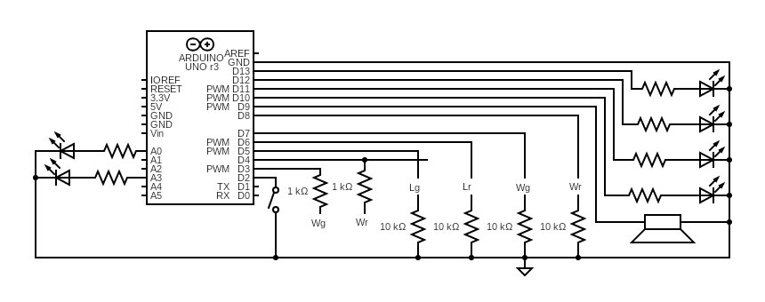

### Circuit

(not up to date, swapped A1 and A2)

| Symbol | Meaning |
|:---:|:---:|
| Wg | Weapon of "green" fencer |
| Wr | Weapon of "red fencer" |
| Lg | Lame of "green" fencer |
| Lr | Lame of "red" fencer |

### Components

| Type | Value | Amount |
|:---:|:---:|:---:|
| Arduino | Uno or similar | 1 |
| Resistor | 10k | 4 |
| Resistor | 1k | 2 |
| Resistor | 220* | 6 |
| Diode | Zener | 2 |
| LED | Green 10mm | 1 |
| LED | Red 10mm | 1 |
| LED | White 10mm | 2 |
| LED | Yellow 10mm | 2 |
| Speaker/Buzzer | any small speaker or buzzer will do** | 1 |
| Switch | Toggle | 1 |
| LED Socket | 10mm | 6 |

*Use LED resistor value according to the LED used and brightness needed. Higher power LED/Lamps might need transistor as digital pins can only supply a limited amount of current (40mA on each pin, 200mA total)

** I am currently using a 8 Ohm 0.25W speaker which seems to run fine on it's own. Higher wattage speakers will need a small amplifier as the Arduino won't be able to provide enough current from it's digital pin.
