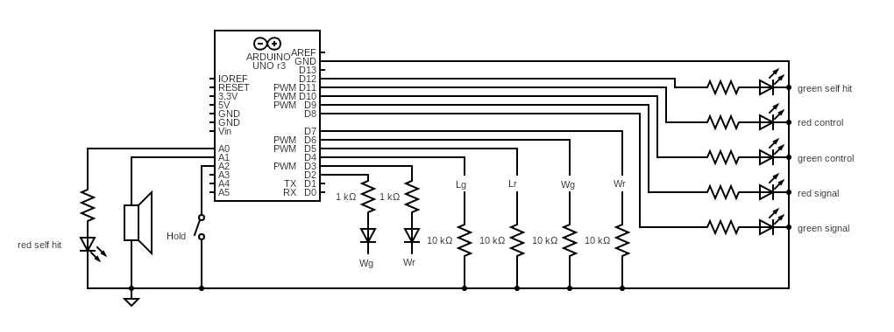

### Circuit

### Symbols

Wg := Weapon "green" fencer

Wr := Weapon "red" fencer

Lg := Lame "green" fencer

Lr := Lame "red" fencer

### Components

| Type | Value | Amount |
|:---:|:---:|:---:|
| Arduino | Uno or similar | 1 |
| Resistor | 10k | 4 |
| Resistor | 1k | 2 |
| Resistor | 220* | 4 |
| LED | Green | 1 |
| LED | Red | 1 |
| LED | White | 2 |
| Speaker/Buzzer | any small speaker or buzzer will do | 1 |
| Switch | Toggle | 1 |

*Use LED resistor value according to the LED used and brightness needed.
